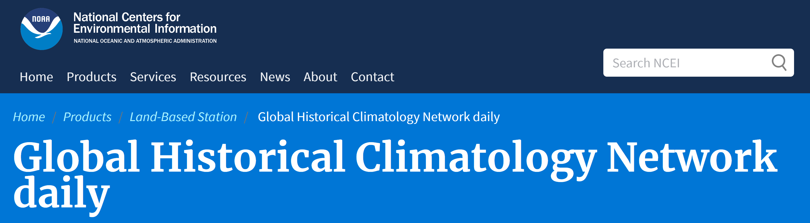

# Climate Exploration with SQLAlchemy

Climate and weather exploration of Hawaii with API database of historical climate data measured by land surface stations. Python and SQLAlchemy used for basic climate analysis and data exploration of the climate database. Analysis completed with SQLAlchemy ORM queries, Pandas, and Matplotlib.

## Historical Climatology Network

## Steps

- Use SQLAlchemy create_engine to connect sqlite database.
- Use SQLAlchemy automap_base() to reflect tables into classes and save a reference to those classes named Station and Measurement.
- Link Python to the database by creating an SQLAlchemy session.

### Precipitation Analysis

- Find the most recent date in the data set.
- Retrieve the last 12 months of precipitation data.
- Load the query results into a Pandas DataFrame.
- Sort the DataFrame values by date.
- Plot the results.
- Print the summary statistics for the precipitation data.

### Station Analysis

- Query to calculate the total number of stations in the dataset.
- Query to find the most active stations.
  - List the stations and observation counts in descending order.
  - Station id with the highest number of observations.
  - Calculate the lowest, highest, and average temperature for the most active station.
- Query to retrieve the last 12 months of temperature observation data (TOBS). 
  - Filter by the station with the highest number of observations.
  - Query the last 12 months of temperature observation data for this station.
  - Plot the results as a histogram with 12 bins.

### Climate App

- Flask API based on the queries developed.
- Use Flask jsonify to convert the API data into a valid JSON response object.
- Use Flask to create routes.
- Routes:
  - /
    - Home page.
    - List all routes that are available.
  - /api/v1.0/precipitation
    - Convert the query results to a dictionary using date as the key and prcp as the value.
    - Return the JSON representation of your dictionary.
  - /api/v1.0/stations
    - Return a JSON list of stations from the dataset.
  - /api/v1.0/tobs
    - Query the dates and temperature observations of the most active station for the last year of data.
    - Return a JSON list of temperature observations (TOBS) for the previous year.
  - /api/v1.0/<start> and /api/v1.0/<start>/<end>
    - Return a JSON list of the minimum temperature, the average temperature, and the max temperature for a given start or start-end range.
    - When given the start only, calculate TMIN, TAVG, and TMAX for all dates greater than and equal to the start date.
    - When given the start and the end date, calculate the TMIN, TAVG, and TMAX for dates between the start and end date inclusive.

## Data Source

- [Global Historical Climatology Network-Daily Database](https://www.ncei.noaa.gov/products/land-based-station/global-historical-climatology-network-daily).

## Authors

- **David W. Mueller**
  - [LinkedIn Profile](https://www.linkedin.com/in/davidwaltermueller/)
  - davemuelle@gmail.com

## Acknowledgments

- Michigan State University Data Analytics Bootcamp; May 26, 2021.

## References

Menne, M.J., I. Durre, R.S. Vose, B.E. Gleason, and T.G. Houston, 2012: An overview of the Global Historical Climatology Network-Daily Database. Journal of Atmospheric and Oceanic Technology, 29, 897-910, <https://doi.org/10.1175/JTECH-D-11-00103.1>
